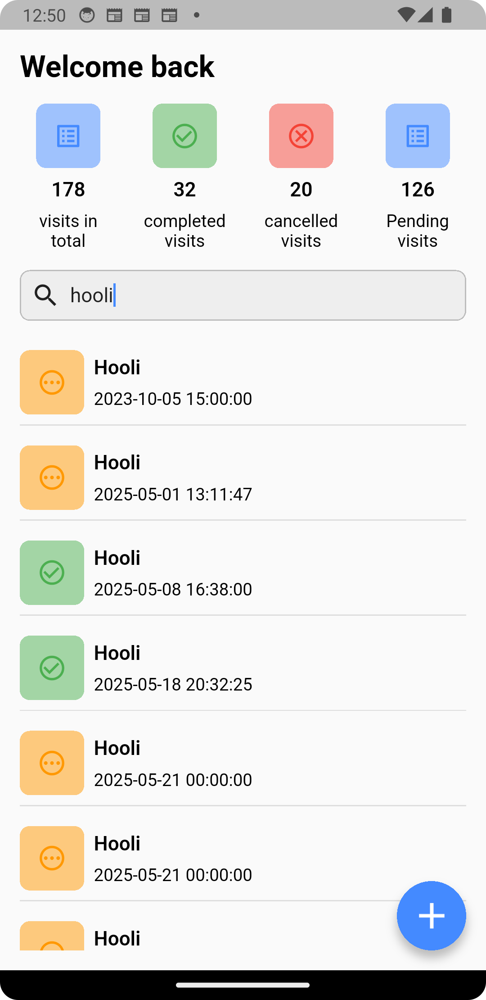
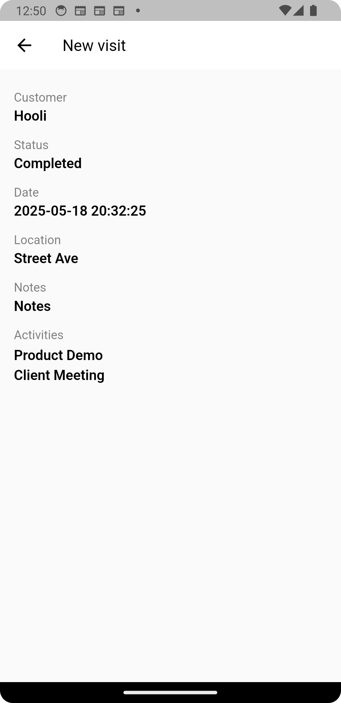
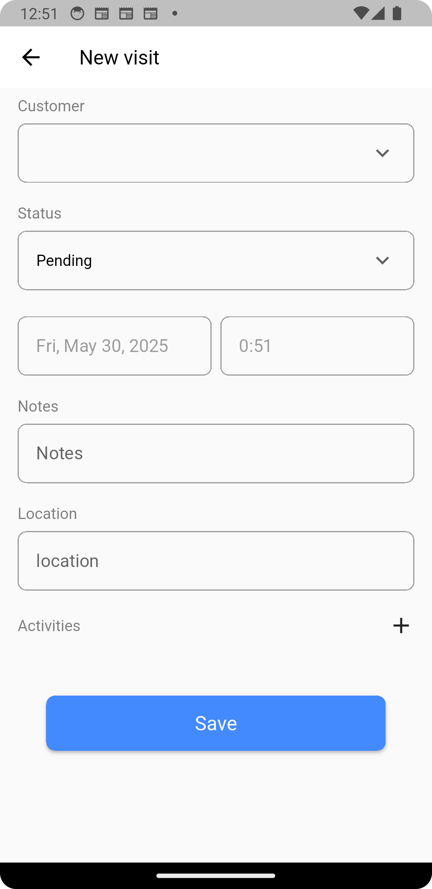

# visit_tracker


Submission for solutech


## Implementation

I split the app in deifferent folders following something similar to the MVVM approach on Android. We have have the api -> Repo -> bloc <- presentation.

## Screen shot are





## Running the code

add a file .env at the root of the project
Add the following to the file
```
API_BASE_URL=url
API_KEY=api_key

```

With the api_key key and base url. 


## Notes on offline support, testing, or CI if implemented

I didn't have enough time to do most of the optional requirement. I did write some unit tests for adding a visit.

## Any assumptions, trade-offs, or limitations

The endpoints for updating and deleting were not working. That will not work on this app aswell.
